<div align="center">


**Software Engineer Full Stack · Consultor en Sofka Technologies**

+4 años construyendo software empresarial para banca, retail y pensiones.

🇨🇴 Barranquilla, Colombia

<br/>



</div>

## 🚀 Lo que estoy construyendo

| | Proyecto | Descripción |
|---|---|---|
| 📱 | **Ocasia** | Mi propia app Android con Kotlin y backend en .NET, rumbo a Google Play. |

## 🧬 Tech DNA

```yaml
backend:      .NET (6–10) · C# · Spring Boot · Node.js
frontend:     Angular (13–18) · TypeScript · React · Tailwind
arquitectura: Microservicios · DAPR · RabbitMQ · Hangfire
infra:        Docker · Kubernetes · Azure DevOps · AWS
datos:        SQL Server · PostgreSQL
ia:           Claude Code · GitHub Copilot · Spec Driven Development
```

## 📫 Contacto

<a href="https://www.linkedin.com/in/TU_USUARIO"></a>
<a href="mailto:jagamez255@gmail.com"></a>

<div align="center">
<br/>
<i>"Primero la especificación, después el código."</i>
</div>
